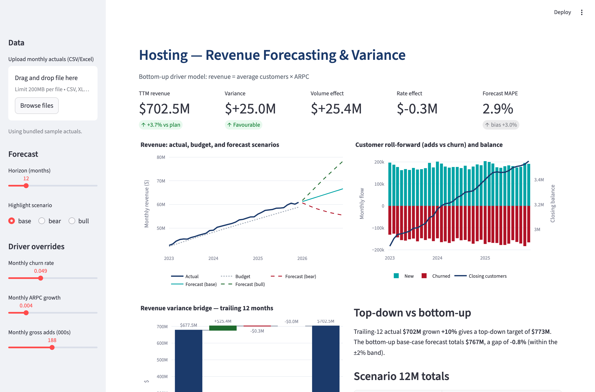
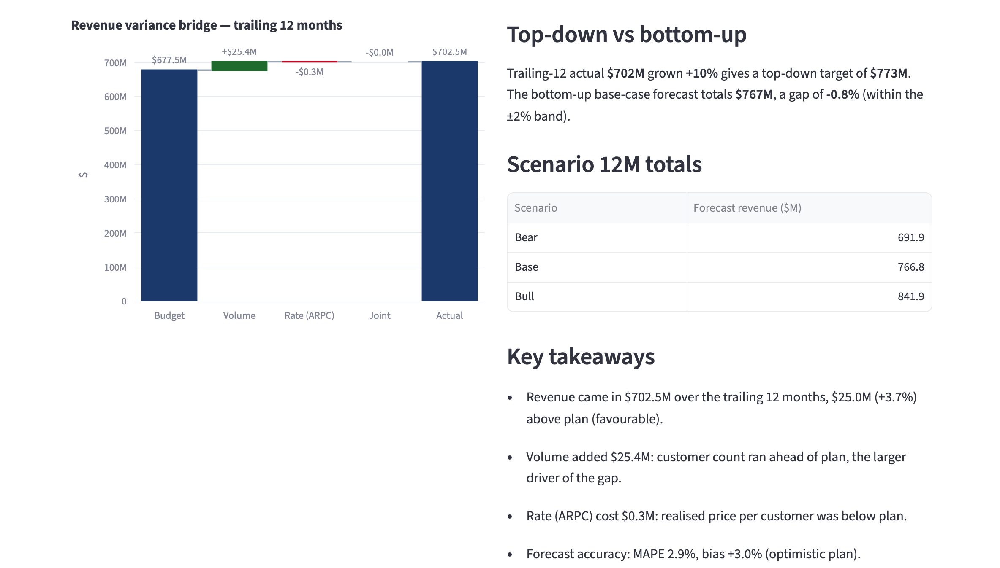
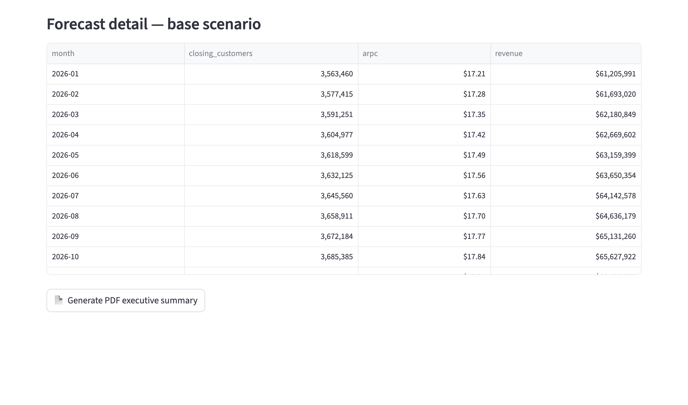

# Hosting — Revenue Forecasting & Variance Automation

A self contained FP&A toolkit for a **Hosting** business. It builds a
bottom up, driver based revenue forecast, compares actuals to budget, decomposes
the revenue variance into **volume (customers) vs rate (ARPC)** effects, and
surfaces everything through an interactive **Streamlit dashboard** and a one page
**PDF executive summary**.

It runs instantly on bundled synthetic data (so it works as a demo) and accepts a
real monthly actuals file (so it works as a repeatable monthly tool).



## Why this exists

In FP&A you do not just say "revenue grows 10%." You build revenue from the
operational **drivers** that cause it to change, you measure actuals against the
plan, and you explain *why* the variance happened. This project demonstrates that
end to end for a SaaS-style Hosting business:

```
churned       = opening_customers x churn_rate
closing       = opening + new - churned
avg_customers = (opening + closing) / 2
revenue       = avg_customers x ARPC
```

## What it does

- **Bottom-up driver forecast** under bear / base / bull scenarios
- **Top-down vs bottom-up reconciliation** (a YoY growth target vs the driver
  build, shown to agree within a 2% band as a confidence check)
- **Variance analysis** of actual vs budget with favourable / unfavourable flags
- **Volume / rate (price-volume) variance bridge** that reconciles exactly to the
  total revenue variance
- **Forecast accuracy** reporting (MAPE and bias)
- **Two delivery surfaces**: an interactive dashboard and an exportable PDF

## Screenshots

| Variance bridge and takeaways | Forecast detail and PDF export |
|---|---|
|  |  |

A sample of the generated PDF executive summary is in
[`docs/sample_output/`](docs/sample_output/hosting_variance_summary.pdf).

## Quick start

```bash
# 1. Install dependencies
pip install -r requirements.txt

# 2. Generate the bundled sample actuals (36 months)
python -m hosting_forecast.data

# 3. Launch the dashboard
streamlit run hosting_forecast/app.py
```

The dashboard opens on the bundled sample. Use the sidebar to upload your own
monthly file, switch scenario, change the forecast horizon, and tune the drivers
(churn, ARPC growth, gross adds). Click **Generate PDF executive summary** to
export the one-pager.

## Run the pieces from the command line

Each module is runnable on its own and prints a useful result:

```bash
python -m hosting_forecast.data        # generate + preview the sample actuals CSV
python -m hosting_forecast.forecast    # 12-month forecast + top-down/bottom-up check
python -m hosting_forecast.variance    # variance table + volume/rate bridge + MAPE
python -m hosting_forecast.pdf_report  # write the PDF executive summary
```

## Input data schema

One row per month. Two ready-made templates ship in
`hosting_forecast/sample_data/`:

- **`hosting_actuals_template.xlsx`** — a formatted Excel workbook with the data
  on sheet 1 ("Hosting Actuals") and a column-by-column guide on sheet 2
  ("Instructions"). This is the file to copy, fill with your own numbers, and
  upload. Regenerate it with `python -m hosting_forecast.excel_template`.
- **`hosting_actuals.csv`** — the same data as CSV, if you prefer a flat file.

The loader reads the **first worksheet**, so keep your data on sheet 1 with the
header names unchanged.

| Column | Meaning |
|---|---|
| `month` | First of month, `YYYY-MM-01` |
| `opening_customers` | Customers at start of month |
| `new_customers` | Gross adds in month |
| `churned_customers` | Customers lost in month |
| `closing_customers` | Customers at end of month |
| `arpc` | Average revenue per customer, monthly $ |
| `revenue` | `avg_customers * arpc` |
| `budget_revenue` *(optional)* | Plan revenue for the month |
| `budget_customers` *(optional)* | Plan closing customers |
| `budget_arpc` *(optional)* | Plan ARPC |

Budget columns are optional. Without them the forecast still runs; the variance
bridge and PDF are skipped.

## Project layout

```
hosting_forecast/
  config.py          Hosting anchors, scenario deltas, paths, palette
  data.py            Synthetic generator + CSV/Excel loader & validation
  forecast.py        DriverForecast roll-forward, scenarios, top-down check
  variance.py        Variance table, volume/rate bridge, MAPE/bias, narrative
  pdf_report.py      Reportlab one-page executive summary
  excel_template.py  Builds the sample Excel upload template
  app.py             Streamlit dashboard (Plotly charts + PDF export)
  sample_data/       Bundled sample actuals (CSV + Excel template)
docs/
  screenshots/       Dashboard screenshots used in this README
  sample_output/     Example generated PDF
```

See [docs/HOW_IT_WAS_BUILT.md](docs/HOW_IT_WAS_BUILT.md) for the methodology,
architecture decisions, and the step-by-step build and verification process.

## Methodology notes

- **Average customers**, not period-end, drive monthly revenue, so a mid-month
  swing in the base is not over- or under-counted.
- The **volume / rate / joint** split is computed so the three effects sum
  exactly to the revenue variance (the residual is shown and is ~0).
- Scenarios adjust churn, gross adds, and ARPC growth rather than a single
  top-line growth number, keeping the story driver-based.

## Disclaimer

All figures are **synthetic** and generated for demonstration. This project uses
no proprietary or confidential data and is not affiliated with any company.
